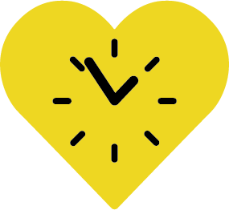

# weilSieDichLieben
_Configure your own personal BVG Public Transport Anzeigetafel and enjoy public transport again!_

## Intro
I had this idea the other day that I wanted my own personal BVG Anzeigetafel in the entrance area of my flat in Berlin, where I see the live departure times for the stations I'm interested in. It should look somewhat nice, and I wanted to run it on any old tablet. Thats why I created weilSieDichLieben.

## Getting started
Just visit www.weilSieDichLieben.de with any browser, configure your stations and you're good to go. On iOS/iPad OS you can also add the page to the Homescreen via the "Share" Button, which gives you this nice fullscreen mode as seen on the pictures below.

## Is this service limited to Berlin, Germany?
No, it's not. The application uses the transport.rest API, which provides data for the entire country of Germany. The website's design is simply themed to match the public transport style of Berlin, but the functionality extends nationwide.

## Notes
Please note that the Website may look odd on small devices, as it was primarily made for a tablet located in my entrance area. You have to try it out.

The WebApp is far from perfect, but I thought i already share this with you in its current state, as it may already help someone. And maybe you have cool ideas that may help with the development.
